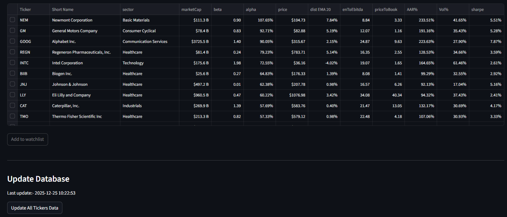
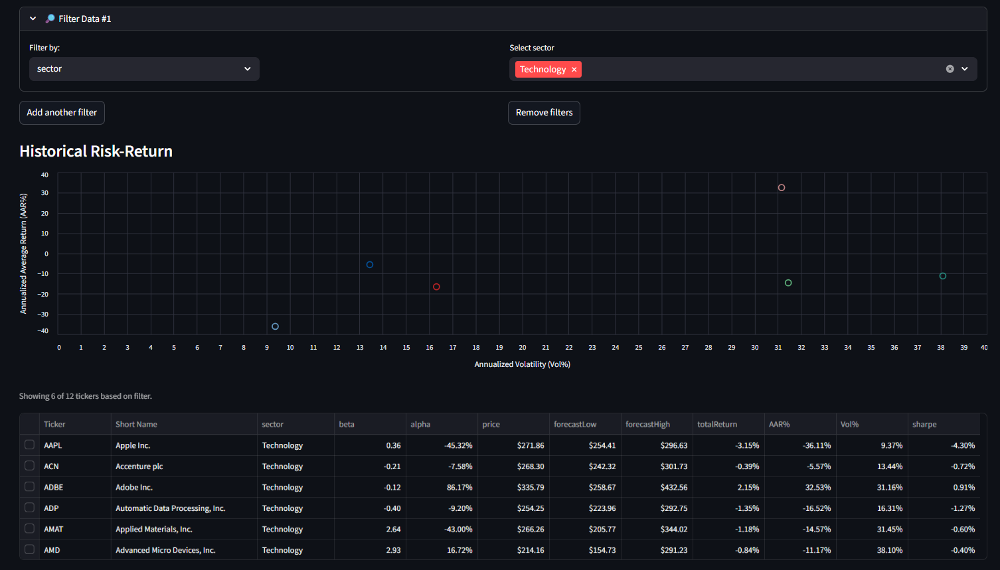
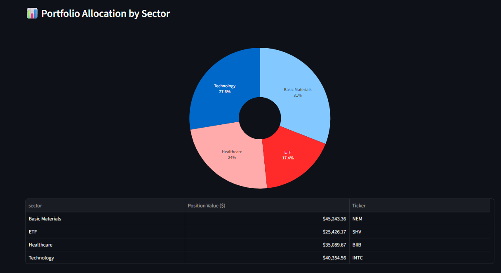
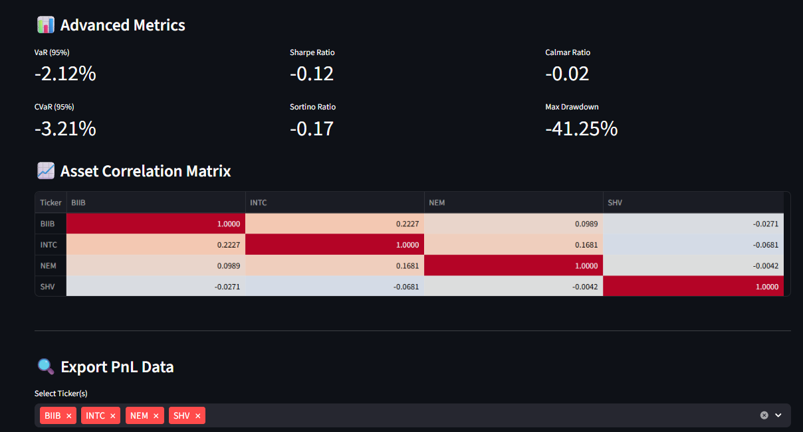
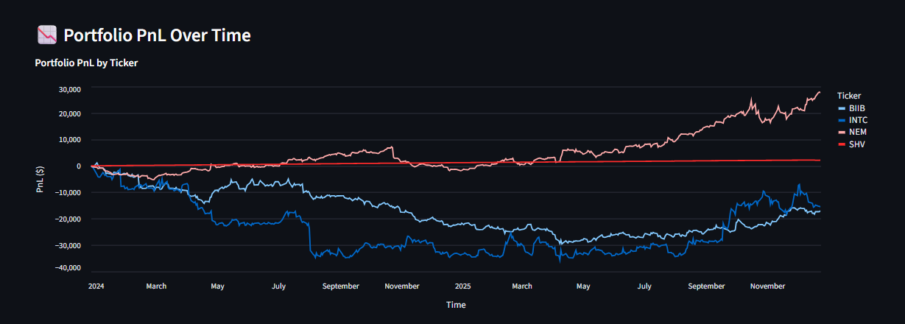
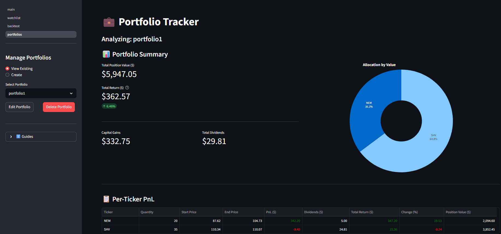

# TradeSentinel
## 📌 Overview
`TradeSentinel` is a Python-powered stock analysis tool designed to bridge the gap between broad market screening and portfolio simulation. It functions as a modular workspace where users can filter market opportunities, track specific assets, and backtest portfolio strategies.

This project was created as part of my practice for the Master in Data Science, Big Data & Business Analytics at Universidad Complutense de Madrid. It arises from a personal need to build a customized stock screener capable of analyzing stocks and ETFs data with tailored criteria and local database management.

---
## 🏗️ App Architecture & Workflow
The application is structured into four pages, designed to support a logical investment analysis workflow:

### 1. Market View (Main)
The entry point of the application acts as a Market Screener.

* Scope: Analyzes the broad market based on the universe of tickers defined in all_tickers.csv.
> **Note:** The benchmark ticker must be included in all_tickers.csv, otherwise the alpha and beta columns will return Nan. If you wish to use a benchmark index different than `SPY`, replace the BENCHMARK_INDEX value in the config.py file.

* Functionality: view fundamental data, filter by sector or metrics, and identify potential opportunities.

* Action: Select interesting tickers and add them directly to your Followed Tickers list.

### 2. Watchlist
A dedicated dashboard for your curated list of assets.

* Scope: Focuses only on the stocks and ETFs you have selected from the Market View.

* Functionality: detailed monitoring of your specific interest list without the noise of the broader market.

* Action: Select a subset of these tickers to send to the Backtest page for performance testing.

### 3. Backtest
A simulation engine for historical performance analysis.

* Scope: Evaluates a hypothetical portfolio based on selected assets.

* Functionality: Calculate annualized returns, volatility, Sharpe Ratio, and visualize cumulative performance over time.

* Usage: Can receive tickers from the Watchlist when creating an equally-weighted portfolio or independently to test any combination of tickers.

### 4. Portfolios
Allows the creation, management, and detailed analysis of custom investment portfolios with realistic transaction tracking.

* Scope: Unlike the Backtest module—which simulates buying a set of assets all at once at the beginning of a period—this module manages real-world portfolios. It handles staggered entry points (buying different assets at different dates), tracks cost basis versus market value, and provides a persistent storage system to save and reload multiple portfolio configurations.

* Functionality: Create, save, edit, and delete multiple named portfolios using a local JSON backend.

* Usage: Can be used as the final step in the workflow, to track the performance of specific portfolios over time.

---
## 📊 Screenshots

<div align="center">

  <h3>Market View Page (main)</h3>

  <p><i>Tickers Universe</i></p>
  

  <br><br>
  <h3>Watchlist Page</h3>

  <p><i>Dynamic filters and plot chart</i></p>
  

  <br><br>

  <h3>Backtest Page</h3>

  <p><i>Portfolio Summary</i></p>
  

  <br><br>
  
  <p><i>Allocation by Sector</i></p>
  

  <br><br>

  <p><i>Advanced Metrics</i></p>
  

  <br><br>

  <p><i>PnL Over Time</i></p>
  

  <br><br>

  <h3>Portfolios Page</h3>

  <p><i>Portfolio Summary</i></p>
  

</div>

---
## 📂 Project Structure

The **TradeSentinel** repository is organized as follows:

```text
TRADESENTINEL/
├── .devcontainer/           # Configuration for VS Code Development Containers
├── data/                    # Local storage for datasets and configuration files
│   ├── stocks/              # Sub-directory for specific stock data
│   ├── all_tickers.csv      # Dataset of available tickers
│   ├── etfs.csv             # Dataset of Exchange Traded Funds
│   ├── followed_tickers.csv # User-specific watched tickers
│   └── portfolios.json      # JSON structure defining user portfolios
├── docs/                    # Documentation resources
├── pages/                   # Dashboard pages (Multi-page application structure)
│   ├── 02_watchlist.py      # Logic for the Watchlist view
│   ├── 03_backtest.py       # Logic for the Backtesting engine view
│   └── 04_portfolios.py     # Logic for Portfolio management view
├── src/                     # Core application source code
│   ├── __init__.py          # Package initialization
│   ├── analytics.py         # Financial calculations and analysis algorithms
│   ├── config.py            # Global configuration and environment settings
│   ├── dashboard_core.py    # Core functionality and state management for the dashboard
│   ├── dashboard_display.py # UI component rendering and display logic
│   └── etl.py               # Extract, Transform, Load (ETL) pipelines for data ingestion
├── tests/                   # Unit and integration tests
├── .gitignore               # Git ignore rules
├── LICENSE                  # Project license
├── main.py                  # Application entry point (Home/Index page)
├── pytest.ini               # Configuration file for running tests via pytest
├── README.md                # Project overview and instructions
└── requirements.txt         # Python dependencies and library versions
```

---
## 📂 Data Configuration
The application is driven by two key CSV files located in the /data/ directory, allowing for easy customization of the analysis universe:

`data/all_tickers.csv`:

* Purpose: Defines the complete "universe" of assets available in the Market View.

* Default Content: Currently includes the S&P 100 constituents and a selection of major ETFs.

* Customization: You can easily customize the screener by adding or removing ticker symbols to this file.

`data/etfs.csv`:

* Purpose: Acts as a lookup file to correctly identify which tickers are ETFs.

* Function: Used primarily to fill "Sector" data for ETFs (which often lack standard sector classification in raw data feeds), ensuring they are categorized correctly in the dashboard.

---
## 🚀 Features
* **Custom Watchlist Management**: Dynamically add or remove tickers from your tracking list directly from the UI.

* **Advanced Risk Metrics**: Computes Value-at-Risk (VaR), annualized volatility, and Sharpe Ratios.

* **Interactive Dashboard**: Built with Streamlit for intuitive data visualization and easy navigation.

* **Total Return Analysis**: Uses adjusted close prices to account for dividends and splits, ensuring PnL calculations reflect true economic return.

---
## 🛠 Tech stack
- **Python:** `pandas`, `numpy`, `altair`, `streamlit`, `plotly`, `duckdb`
- **Data APIs:** `Yahoo Finance`

---
## 📈 Example use case
* 1) **Screening**: You open the Market View and notice that the Tech sector is outperforming. You filter for Tech stocks with high momentum and select NVDA and AMD.

* 2) **Tracking**: You add them to the watchlist. A week later, you review this page and decide you want to see how a portfolio split 50/50 between them would have performed vs. the S&P 500.

* 3) **Simulation**: You select them and click "Backtest Portfolio". The Backtest page opens, showing you the historical Drawdown and Volatility of that specific combination.

---
## 🚀 Launch app

To run TradeSentinel on your own machine:

1. **Clone the repository**
   ```bash
   git clone https://github.com/sebakremis/tradesentinel.git
   cd tradesentinel

2. Create and activate a virtual environment (recommended)
    ```bash
    python -m venv .venv
    source .venv/bin/activate   # On Linux/Mac
    .venv\Scripts\activate      # On Windows

4. Install dependencies
    ```bash
    pip install -r requirements.txt
    
6. Launch the Streamlit app
    ```bash
    streamlit run main.py

---
## 📌 Disclaimer
This project was developed strictly for **academic and educational purposes**.  
It is intended to demonstrate portfolio analytics, risk metrics, and visualization techniques in Python.  

⚠️ **Important:** TradeSentinel does **not** provide financial advice, investment recommendations, or trading guidance.  
Any outputs, simulations, or metrics generated by this tool should be treated as illustrative examples only.  
Users are solely responsible for any decisions made based on the information produced by this project.

---
## 📜 License
This repository is publicly available under the terms of the **MIT License**.  
You are free to use, modify, and distribute the code for any purpose.

For full details, please see the [MIT License](LICENSE) file included in this repository.
